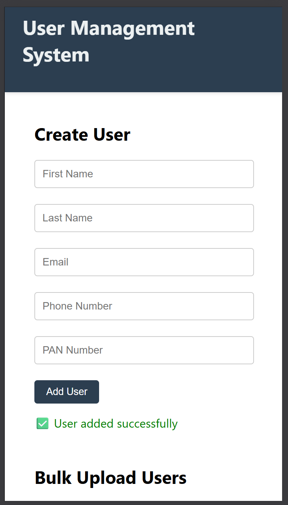

## 📸 Demo Screenshot

## User Management System

A full-stack user management application built with React, Node.js, Express, and MySQL.The application allows you to:

-> Add, edit, and delete users.

-> Bulk upload users via Excel.

-> Download the complete user list as Excel.

### Technologies Used

-> Frontend: React (with Axios)

-> Backend: Node.js + Express.js

-> Database: MySQL

-> Excel Handling: Multer, XLSX

🛠 Setup Instructions

1️⃣ Clone the Repository:

git clone https://github.com/sujal-chauhan/user-management-system.git
cd UserManagementSystem

2️⃣ Database Setup:

-> Open MySQL Workbench.

-> Run the SQL script provided in /database/user_management.sql to create the database and table.

### Example SQL:

CREATE DATABASE user_management;
USE user_management;

CREATE TABLE users (
  id INT AUTO_INCREMENT PRIMARY KEY,
  first_name VARCHAR(100),
  last_name VARCHAR(100),
  email VARCHAR(150),
  phone_number VARCHAR(15),
  pan_number VARCHAR(15)
);

✅ You can also directly import the provided .sql file in MySQL Workbench.

3️⃣ Excel Template:

-> Use the sample Excel template provided in /assets/sample-template.xlsx.

-> Make sure your Excel file columns match this format:

first_name

last_name

email

phone_number

pan_number

## 📸 Demo Screenshot

## 💻 How to Run Locally

A. Start the Backend:

cd backend
npm install
npm start

The backend server will run at http://localhost:5000.

B. Start the Frontend:

cd ../frontend
npm install
npm start

The frontend will run at http://localhost:3000.

✅ Open your browser and visit:
http://localhost:3000

⚙️ Additional Notes:

PAN number validation follows Indian PAN format (ABCDE1234F).

Basic client-side validation is included.

No authentication or role-based access control is implemented.

Tables are responsive and support horizontal scrolling on smaller screens.

